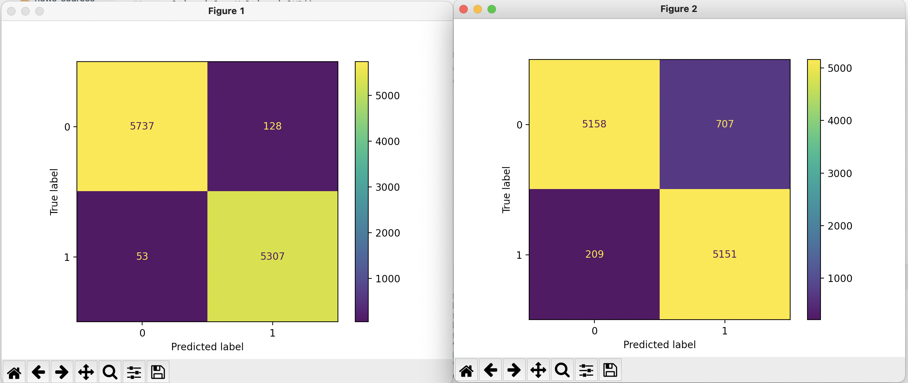

# fake-news-finder
This is my semester one scikit-learn project, using the library and publicly available datasets to (try to) detect fake news.

### What is the problem that this project aims to solve?
This project aims to classify any article as real or fake. Its goal is to identify fake articles and to give some insight into the patterns that exist in real and fake news.

### What is the dataset? Why did you choose it? Did you scale it? Are there outliers?
The dataset that I picked came from [Kaggle](https://www.kaggle.com/clmentbisaillon/fake-and-real-news-dataset) and contains around 11,000 articles, each classified as real or fake. It's honestly quite long (the two CSV files total to around 115 megabytes!), and it takes a bit of time to train the algorithm. I chose it because of the aforementioned problem: I thought it would make for both a cool and useful project. I did not have to scale my data, because I only considered one variable, the article text. I did clean the data by removing common words like "the" and "and", making each article more distinct. While I didn't read over the thousands of articles, I don't imagine there are any significant "outliers" because the data comes in form of articles, each of which is unique and none of which follow a certain predefined pattern.

### What algorithms were tested?
I tested two algorithms for text classification. The first was a [Multinomial Naive Bayes classifier](https://scikit-learn.org/stable/modules/generated/sklearn.naive_bayes.MultinomialNB.html), which (from my understanding) classifies articles by focusing on how many times a feature shows up. This algorithm was fairly accurate, scoring around 92% accuracy under three random state tests. The second algorithm was a [Bernoulli Naive Bayes classifier](https://scikit-learn.org/stable/modules/generated/sklearn.naive_bayes.BernoulliNB.html#sklearn.naive_bayes.BernoulliNB). If I understand correctly, the Bernoulli classifier runs similarly to the Multinomial classifier, but rather than focusing on how many times different terms may appear, the Bernoulli classifier instead focuses on whether or not a feature is present in the article to begin with. This classifier was also successful, averaging around a 98% accuracy rate over the same three random states. In the end, I chose to go with the Bernoulli classifier because it was more accurate with little drawbacks: for example, the Bernoulli and Multinomial models have the same [time complexity](https://nlp.stanford.edu/IR-book/html/htmledition/the-bernoulli-model-1.html), so there's no time advantage to using the Multinomial one.

_Figure one is the confusion matrix of a Bernoulli test; figure two is the confusion matrix of a Multinomial test. As one can see here, the Bernoulli classifier made fewer errors on the same dataset._

### How should I run this code?
There are two ways to run this code. The first would be by running ``findFakeNews.py``, which trains the model and runs a ``train_test_split()`` on the dataset to test it out. This code also has six articles built in, which the model then predicts on: it gets 5/6 correct, with one false negative built in. Although this algorithm performed well, it definitely is not perfect!

The second way to run this code would be by running the Django site I've built in this repository in the ``newsSite`` folder. It'll require the pickled vectorizer and classifier being added to the ``newsSite/classifier`` folder, which were too big to commit to GitHub but can be found [here](https://drive.google.com/drive/folders/1hWz1xahCvk-_l-wm0RbraeapmHFIV0jh?usp=sharing). I made this site for a couple of reasons: I wanted to see if the algorithm could be put on a website (it's possible!), and I also wanted to make the project usable—while having an algorithm on its own can be cool, being able to use it is more relevant, especially given the nature of this project. The website was made somewhat hastily and is pretty basic, so I hope there aren't any errors I haven't found. It can take a bit to make a prediction on an article (think 5-10 seconds), but I've never had it take so long that an issue was raised.